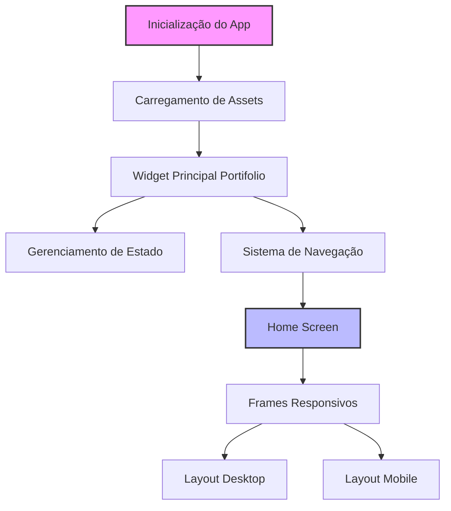

# Portfólio Interativo em Flutter

Este projeto é um portfólio interativo desenvolvido em Flutter, apresentando uma interface moderna e responsiva com animações fluidas.

## Arquitetura e Fluxo de Execução

### 1. Inicialização do App (`main.dart`)
- O ponto de entrada do aplicativo está em `main.dart`
- Inicializa o widget principal `Portifolio`

### 2. Widget Principal (`portifolio.dart`)
O widget `Portifolio` é responsável por:
- Gerenciar o estado de navegação usando Provider
- Pré-carregar assets SVG para melhor performance
- Configurar o tema e gradiente principal do app
- Renderizar o `NavigationWrapper` quando os assets estão carregados

### 3. Tela Inicial (`home_screen.dart`)
A `HomeScreen` implementa:
- Layout responsivo usando `ResponsiveFrameLayout`
- Frames interativos que se adaptam ao tamanho da tela

### 4. Sistema de Frames Responsivos
#### ResponsiveFrameLayout
- Gerencia a disposição dos frames na tela
- Adapta-se automaticamente para layouts mobile (≤768px) e desktop
- Implementa animações suaves com duração de 500ms usando `Curves.easeInOutCubic`
- Utiliza `AnimatedPositioned` e `AnimatedContainer` para transições fluidas

#### HoverableFrame
- Adiciona interatividade aos frames
- Implementa efeitos de hover para melhor experiência do usuário

## Estrutura do Projeto
```
lib/
├── config/         # Configurações do app
├── data/          # Camada de dados
├── domain/        # Regras de negócio e modelos
├── routing/       # Sistema de navegação
├── ui/            # Interface do usuário
│   ├── core/      # Widgets e constantes compartilhadas
│   └── features/  # Funcionalidades principais
└── utils/         # Utilitários gerais
```

## Fluxo de Animações
1. Ao iniciar o app, os SVGs são pré-carregados para garantir uma experiência fluida
2. Durante o carregamento, é exibido um indicador de progresso centralizado
3. Os frames são posicionados dinamicamente baseados no tamanho da tela
4. Todas as transições de posição e tamanho são animadas suavemente

## Fluxograma da Aplicação



## Tecnologias Utilizadas
- Flutter
- Provider (Gerenciamento de Estado)
- SVG Rendering
- Animações Implícitas do Flutter
