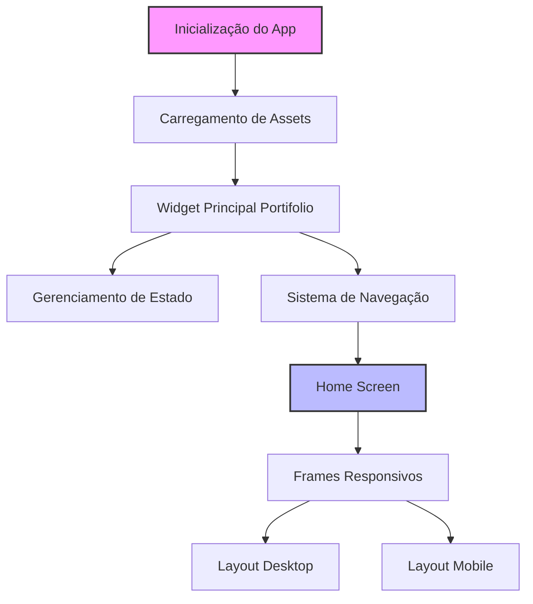

# Portfólio Interativo em Flutter

Este projeto é um portfólio interativo desenvolvido em Flutter, apresentando uma interface moderna e responsiva com animações fluidas.

## Arquitetura e Fluxo de Execução

### 1. Inicialização do App (`main.dart`)
- O ponto de entrada do aplicativo está em `main.dart`
- Inicializa o widget principal `Portifolio`

### 2. Widget Principal (`portifolio.dart`)
O widget `Portifolio` é responsável por:
- Gerenciar o estado de navegação usando Provider
- Pré-carregar assets SVG para melhor performance
- Configurar o tema e gradiente principal do app
- Renderizar o `NavigationWrapper` quando os assets estão carregados

### 3. Tela Inicial (`home_screen.dart`)
A `HomeScreen` implementa:
- Layout responsivo usando `ResponsiveFrameLayout`
- Frames interativos que se adaptam ao tamanho da tela

### 4. Sistema de Frames Responsivos
#### ResponsiveFrameLayout
- Gerencia a disposição dos frames na tela
- Adapta-se automaticamente para layouts mobile (≤768px) e desktop
- Implementa animações suaves com duração de 500ms usando `Curves.easeInOutCubic`
- Utiliza `AnimatedPositioned` e `AnimatedContainer` para transições fluidas

#### HoverableFrame
- Adiciona interatividade aos frames
- Implementa efeitos de hover para melhor experiência do usuário

## Navegação Interativa

### Estratégia de Navegação
O projeto implementa uma navegação inovadora que suporta múltiplos métodos de interação:

#### Navegação por Scroll do Mouse
- Permite navegar entre telas usando a roda do mouse
- Implementado no `NavigationWrapper`
- Suporta scroll para cima e para baixo
- Usa um mecanismo de debounce para prevenir scrolls acidentais

#### Navegação por Gestos Touch (Mobile-Friendly)
- Implementa gestos de arrasto (drag) para navegação
- Suporta navegação intuitiva em dispositivos móveis
- Limiar de sensibilidade de 50 pixels para evitar navegações acidentais

**Lógica de Navegação:**
```dart
void _handleNavigation(dynamic event) {
  // Scroll do mouse
  if (event is PointerScrollEvent && _canScroll()) {
    // Navega para próxima ou página anterior
    if (event.scrollDelta.dy > 0) {
      provider.navigateToNext();
    } else {
      provider.navigateToPrevious();
    }
  }
  
  // Gestos de arrasto
  if (event is PointerUpEvent) {
    final dragDistance = event.position.dy - _initialDragPosition;
    
    if (dragDistance < -dragThreshold) {
      // Arrasto para baixo: próxima página
      provider.navigateToNext();
    } else if (dragDistance > dragThreshold) {
      // Arrasto para cima: página anterior
      provider.navigateToPrevious();
    }
  }
}
```

**Recursos Principais:**
- 🖱️ Suporte a scroll do mouse
- 👆 Gestos de arrasto intuitivos
- 🔒 Prevenção de navegações acidentais
- 📱 Compatível com desktop e mobile

## Estrutura do Projeto
```
lib/
├── config/         # Configurações do app
├── data/          # Camada de dados
├── domain/        # Regras de negócio e modelos
├── routing/       # Sistema de navegação
├── ui/            # Interface do usuário
│   ├── core/      # Widgets e constantes compartilhadas
│   └── features/  # Funcionalidades principais
└── utils/         # Utilitários gerais
```

## Fluxo de Animações
1. Ao iniciar o app, os SVGs são pré-carregados para garantir uma experiência fluida
2. Durante o carregamento, é exibido um indicador de progresso centralizado
3. Os frames são posicionados dinamicamente baseados no tamanho da tela
4. Todas as transições de posição e tamanho são animadas suavemente

## Fluxograma da Aplicação


```mermaid
graph TD
    A[Inicialização do App] --> B[Carregamento de Assets]
    B --> C[Widget Principal Portifolio]
    C --> D[Gerenciamento de Estado]
    C --> E[Sistema de Navegação]
    E --> F[Home Screen]
    F --> G[Frames Responsivos]
    G --> H[Layout Desktop]
    G --> I[Layout Mobile]
    
    style A fill:#f9f,stroke:#333,stroke-width:2px
    style F fill:#bbf,stroke:#333,stroke-width:2px
```

## Tecnologias Utilizadas
- Flutter
- Provider (Gerenciamento de Estado)
- SVG Rendering
- Animações Implícitas do Flutter
