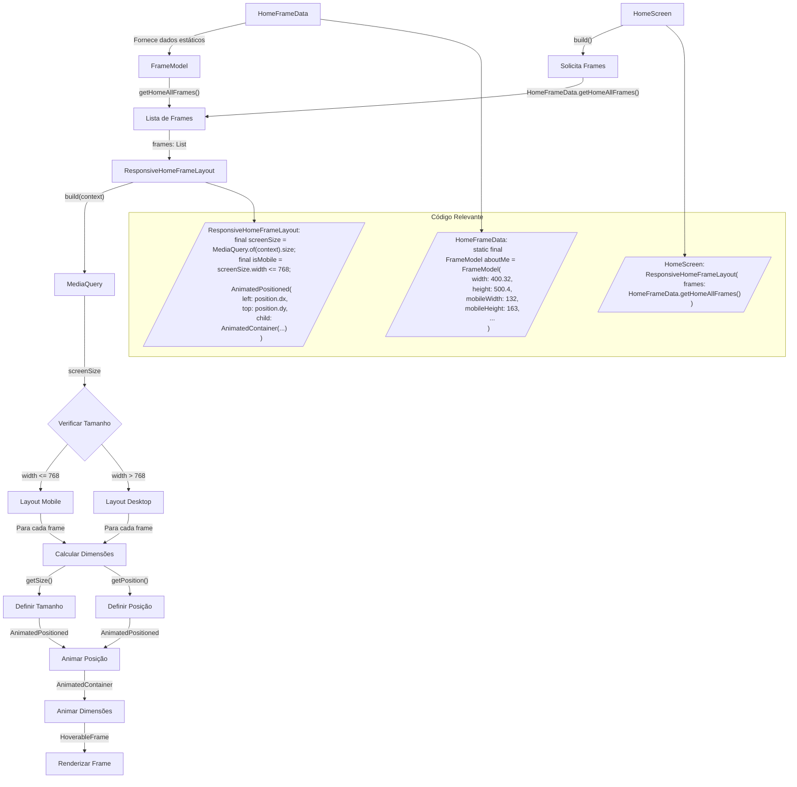

```mermaid
graph TB
    %% Data Layer
    A[HomeFrameData] -->|Fornece dados estáticos| B[FrameModel]
    B -->|"getHomeAllFrames()"| C[Lista de Frames]
    
    %% UI Layer - HomeScreen
    D[HomeScreen] -->|"build()"| E[Solicita Frames]
    E -->|"HomeFrameData.getHomeAllFrames()"| C
    
    %% ResponsiveHomeFrameLayout
    C -->|"frames: List<FrameModel>"| F[ResponsiveHomeFrameLayout]
    
    %% Responsive Logic
    F -->|"build(context)"| G[MediaQuery]
    G -->|"screenSize"| H{Verificar Tamanho}
    H -->|"width <= 768"| I[Layout Mobile]
    H -->|"width > 768"| J[Layout Desktop]
    
    %% Frame Rendering
    I & J -->|"Para cada frame"| K[Calcular Dimensões]
    K -->|"getSize()"| L[Definir Tamanho]
    K -->|"getPosition()"| M[Definir Posição]
    
    %% Animation
    L & M -->|"AnimatedPositioned"| N[Animar Posição]
    N -->|"AnimatedContainer"| O[Animar Dimensões]
    O -->|"HoverableFrame"| P[Renderizar Frame]

    %% Code Snippets
    subgraph Código Relevante
        S1[/"HomeScreen:
        ResponsiveHomeFrameLayout(
            frames: HomeFrameData.getHomeAllFrames()
        )"/]
        
        S2[/"HomeFrameData:
        static final FrameModel aboutMe = FrameModel(
            width: 400.32,
            height: 500.4,
            mobileWidth: 132,
            mobileHeight: 163,
            ...
        )"/]
        
        S3[/"ResponsiveHomeFrameLayout:
        final screenSize = MediaQuery.of(context).size;
        final isMobile = screenSize.width <= 768;
        
        AnimatedPositioned(
            left: position.dx,
            top: position.dy,
            child: AnimatedContainer(...)
        )"/]
    end

    %% Conexões com Código
    D --> S1
    A --> S2
    F --> S3
```
